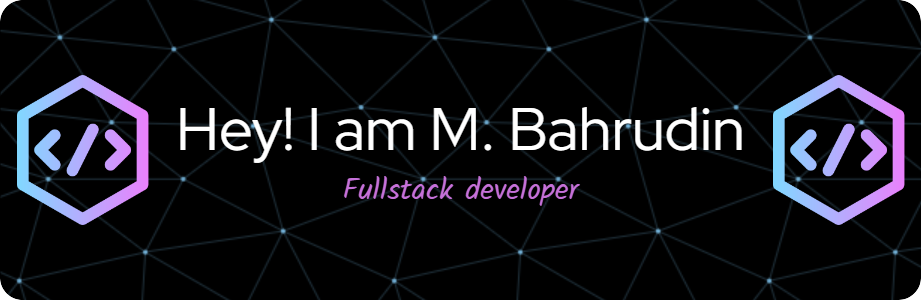

## Hi World! I'm M.Bahrudin 👋

  <!-- Teks About Me (Markdown tetap diparse) -->
  

  
  ### 💫 About Me:

- 🔭 I’m currently working on campus Politeknik Sriwijaya
- 🌱 I’m currently learning [**React**](https://react.dev/) Library
- 😊😊😊

  

  <!-- Gambar -->

### 🌐 Socials:

   

### 💻 Tech Stack:

                   

### 📊 GitHub Stats:

 
 

### 🏆 GitHub Trophies

### 🔝 Top Contributed Repo

---

<h3 align="left">PLay Game With Me</h3>

###

<picture>
  <source media="(prefers-color-scheme: dark)" srcset="https://raw.githubusercontent.com/Rudin1409/Rudin1409/output/pacman-contribution-graph-dark.svg">
  <source media="(prefers-color-scheme: light)" srcset="https://raw.githubusercontent.com/Rudin1409/Rudin1409/output/pacman-contribution-graph.svg">
  
</picture>

###

###

<!-- Proudly created with GPRM ( https://gprm.itsvg.in ) -->
<!-- 

- 🔭 I’m currently working on campus Politeknik Sriwijaya
- 🌱 I’m currently learning [**React**](https://react.dev/) Library
- 😊😊😊

##### Skill

##### Connect With Me
   

##### My Github Stats
 -->
